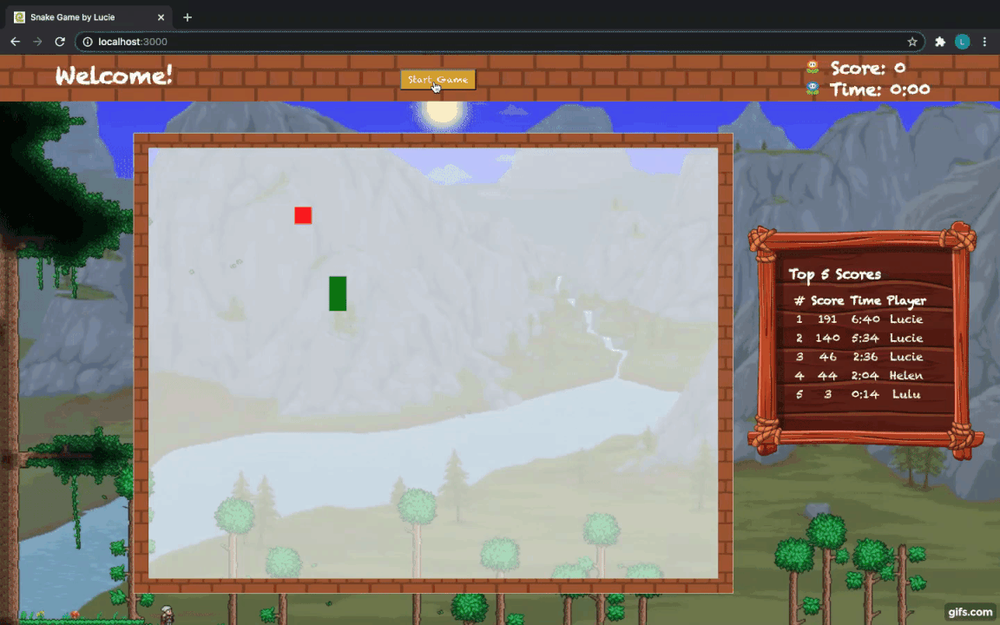
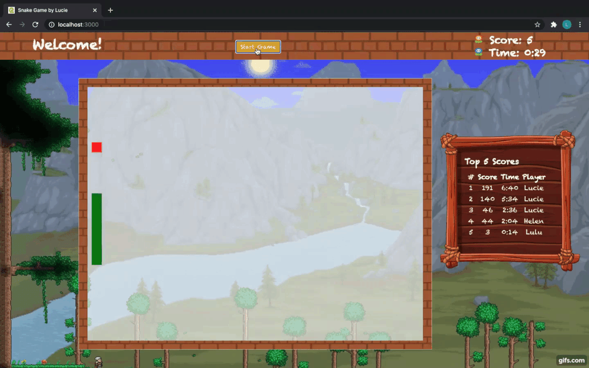

# snake_game
Snake Game is one of my favorite games in my childhood. I always played it on my dad's phone. I used the MERN stack (MongoDB, Express.js, React.js, Node.js) to recreate a simple version of this game, for practice, for fun and for my good merories. 

Here are what I did for this project:
<ul>
<li>Built from scratch the front-end web development in React.js using HTML, CSS, JavaScript</li>
<li>Designed the logic to randomize the fruit placement, dynamic movement of the snake, speed changes and endGame conditions (check collisions)</li>
<li>Utilized Express.js, a server-side application framework to wrap HTTP requests and responses, and made it easy to map URLs to server-side functions</li>
<li>Extracted, sorted and displayed Top 5 Players based on the Score and Time spent of the player records from MongoDB</li>
<li>Built "Show Off Your Score" form to submit current time and score through Axios call back to MongoDB</li>
</ul>

Have fun playing the game!!!

  

  

  

